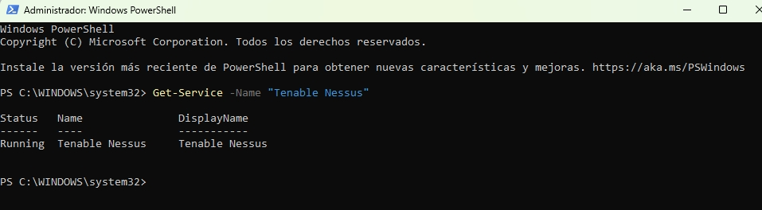

# 🛡️Nessus Expert
> En esta sección detallo los motivos por los cuales he seleccionado Nessus Expert para este laboratorio, destacando sus capacidades de visibilidad sobre la superficie de ataque moderna

## 📝 Introducción

Realizo una auditoría de seguridad utilizando Nessus Expert sobre un entorno controlado en Windows 11. Mi objetivo es demostrar la capacidad de identificar, clasificar y priorizar vulnerabilidades tanto en activos internos como en la superficie de ataque externa. Esta práctica simula un flujo de trabajo real de un analista de ciberseguridad, desde la fase de reconocimiento hasta la propuesta de remediación.

## ¿Qué es Nessus Expert?
Nessus Expert es una de las herramienta de escaneo de vulnerabilidades más confiable del mercado. A diferencia de las versiones tradicionales, esta variante está diseñada para la superficie de ataque moderna. No solo analiza activos de red clásicos (servidores, PCs), sino que amplía su alcance a la infraestructura en la nube, el escaneo de aplicaciones web y la auditoría de Infraestructura como Código (IaC). Es la solución que nos permite a nosotros como analistas de seguridad obtener una visibilidad externa e interna completa bajo una misma consola.

## ¿Por qué utilizar Nessus Expert?

He seleccionado la versión **Expert** frente a la Professional o Essentials por su capacidad de ir más allá de la red tradicional. Como estoy documentando una auditoría integral, necesito las funciones exclusivas que esta versión ofrece.

### 📊 Comparativa Técnica: Nessus Expert (Análisis General)

| Característica | ✅ Ventajas (Pros) | ❌ Desventajas (Contras) |
| :--- | :--- | :--- |
| **Capacidad de Detección** | Posee una de las bibliotecas de plugins más extensas del mercado, actualizándose casi a diario. | La profundidad del análisis puede generar falsos positivos que requieren validación manual. |
| **Métricas de Riesgo** | El sistema **VPR** permite priorizar vulnerabilidades basándose en la probabilidad real de ataque. | Algunas métricas avanzadas requieren que el activo sea escaneado con credenciales de administrador. |
| **Versatilidad de Escaneo** | Permite desde auditorías rápidas de red hasta análisis profundos de cumplimiento (Compliance) y auditoría web. | La configuración de escaneos muy específicos (Advanced Scans) tiene una curva de aprendizaje elevada. |
| **Entorno de Trabajo** | La instalación en Windows 11 es estable y la interfaz web es intuitiva para la gestión de reportes. | El motor de escaneo demanda altos recursos de CPU y RAM, limitando el uso de otras aplicaciones. |
| **Licenciamiento Trial** | La versión Expert permite probar funciones de última generación bajo un límite de 32 hosts. | La limitación de hosts impide realizar auditorías de redes de clase C completas (/24). |

## 🛠️ Guía de Instalación y Configuración

Para replicar este entorno de auditoría en **Windows 11**, sigo estos pasos de manera secuencial:

1. **Descarga de software:** obtengo el instalador oficial de **Nessus Expert** directamente desde el portal de descargas de Tenable, seleccionando la arquitectura compatible con mi sistema.
2. **Ejecución del instalador:** ejecuto el archivo `.msi` y sigo las instrucciones del asistente. Durante este proceso, verifico que el servicio `nessusd` se inicie correctamente. Para comprobar el estado del servicio en Windows 11, utilizo uno de los siguientes métodos:

    * **Mediante PowerShell (Recomendado):** abro una terminal como administrador y ejecuto el comando:
      ```powershell
       Get-Service -Name "Tenable Nessus"
      ```
      
    * **Mediante la interfaz gráfica:** presiono `Win + R`, escribo `services.msc` y localizo el servicio llamado **Tenable Nessus**. Su estado debe figurar como **"En ejecución"** (Running).
4. **Activación de la instancia:** accedo a la interfaz web a través de la dirección `https://localhost:8834`. Utilizo mi clave de licencia **Trial** (limitada a 32 hosts) para completar el registro y activar todas las capacidades de la versión Expert.
5. **Actualización crítica de Plugins:** una vez activado, espero a que la herramienta descargue e instale las últimas definiciones de vulnerabilidades. Considero este paso fundamental para garantizar que los resultados del escaneo sean precisos y detecten las amenazas más recientes.

## 🎯 Caso Práctico: Auditoría Avanzada con Credenciales

Para profundizar en las capacidades de **Nessus Expert**, he realizado una auditoría de "Caja Blanca" siguiendo los estándares de hardening de la industria. 

* **Metodología detallada:** puedes consultar el paso a paso técnico, la configuración de Windows y los resultados en mi guía especializada:
  👉 **[Guía de Auditoría con Credenciales y Compliance](/caso_práctico/auditoría_avanzada.md)**

> **Nota:** esta prueba demuestra la transición de un escaneo de red básico a una auditoría de cumplimiento profesional.

## 💻 Requisitos del Sistema (Entorno de Laboratorio desde una VM)

Para asegurar un rendimiento óptimo de **Nessus Expert** durante los escaneos intensivos en mi máquina local, valido los siguientes requisitos mínimos:

* **🔠Sistema Operativo:** Windows 11 Pro/Home (64-bit).
* **🧠Procesador (CPU):** 4 núcleos de 2 GHz (mínimo recomendado para evitar cuellos de botella durante la compilación de plugins).
* **💾Memoria RAM:** 8 GB de RAM (se recomienda disponer de al menos 4 GB libres antes de iniciar el servicio `nessusd`).
* **💽Espacio en Disco:** 10 GB de espacio libre dedicado principalmente a la base de datos de plugins y al almacenamiento de los historiales de escaneo.
* **🌐Navegador Web:** Google Chrome, Mozilla Firefox o Microsoft Edge actualizado para visualizar correctamente los gráficos del dashboard y estar actualizado.

> **Nota de rendimiento:** durante la fase de ejecución, monitorizo el Administrador de Tareas de Windows 11. Observo que el proceso de compilación de plugins es el que mayor carga de CPU genera. Por ello, cierro aplicaciones innecesarias antes de lanzar un escaneo avanzado para garantizar la integridad de los tiempos de respuesta del análisis.

## 💡 Conclusiones y Aprendizajes

Tras completar la configuración y ejecución de las auditorías con **Nessus Expert**, extraigo las siguientes conclusiones clave sobre la gestión de vulnerabilidades:

* **Visibilidad integral:** el uso de una herramienta de grado empresarial me permite pasar de una visión reactiva a una proactiva. He comprendido que identificar los activos (Discovery) es tan crítico como analizar sus fallos, ya que no se puede proteger lo que no se sabe que existe.
* **Priorización basada en riesgo:** la experiencia con la métrica VPR de Tenable me ha enseñado que no todas las vulnerabilidades críticas requieren atención inmediata; la clave de un analista eficiente es identificar cuáles tienen una probabilidad de explotación real en el contexto actual de amenazas.
* **Optimización de recursos:** la monitorización del sistema durante los escaneos me ha permitido entender el impacto técnico de las herramientas de seguridad en la infraestructura. La gestión del hardware y la correcta configuración de los plugins son determinantes para la calidad de los resultados.
* **Valor estratégico de Nessus Expert:** confirmo que las capacidades de análisis de superficie externa y IaC convierten a esta herramienta en una solución robusta para entornos modernos, yendo mucho más allá del escaneo de red tradicional.

Este proyecto consolida mi capacidad para desplegar soluciones de seguridad complejas, interpretar datos técnicos y documentar procesos de auditoría siguiendo estándares profesionales.


---

## 🤝 Contacto

Si tienes alguna pregunta sobre este proyecto o quieres conectar para hablar sobre ciberseguridad y gestión de vulnerabilidades, no dudes en contactarme:

* **🔗LinkedIn:** [Victor Suárez Sánchez-Pascuala](https://www.linkedin.com/in/victorssp/)
* **🔗GitHub:** [Victor875](https://github.com/Victor875)

---
## ⚖️ Licencia de Uso

Este proyecto está bajo la **Licencia MIT**: puedes usar, copiar y modificar el contenido libremente, siempre que se mantenga el reconocimiento de la autoría original.

> **Nota legal:** este laboratorio tiene fines estrictamente educativos. El uso de **Nessus Expert** está sujeto a los términos de servicio de **Tenable**. No me hago responsable del mal uso de las herramientas o técnicas descritas en este repositorio sobre entornos no autorizados.

---
*✨ Este proyecto fue realizado como parte de mi laboratorio de especialización en herramientas de seguridad ofensiva y defensiva.*
