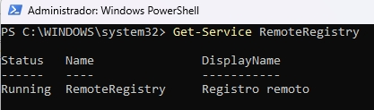
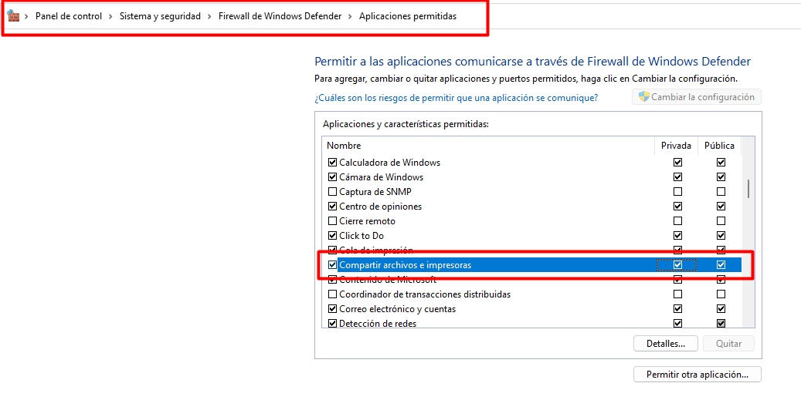
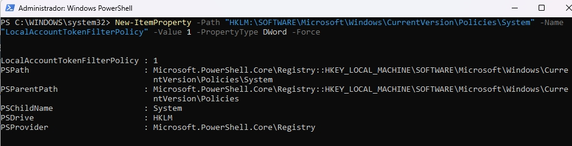
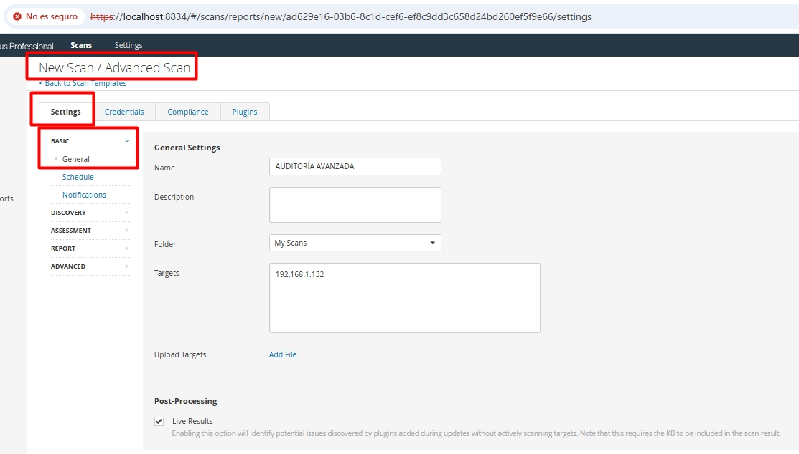
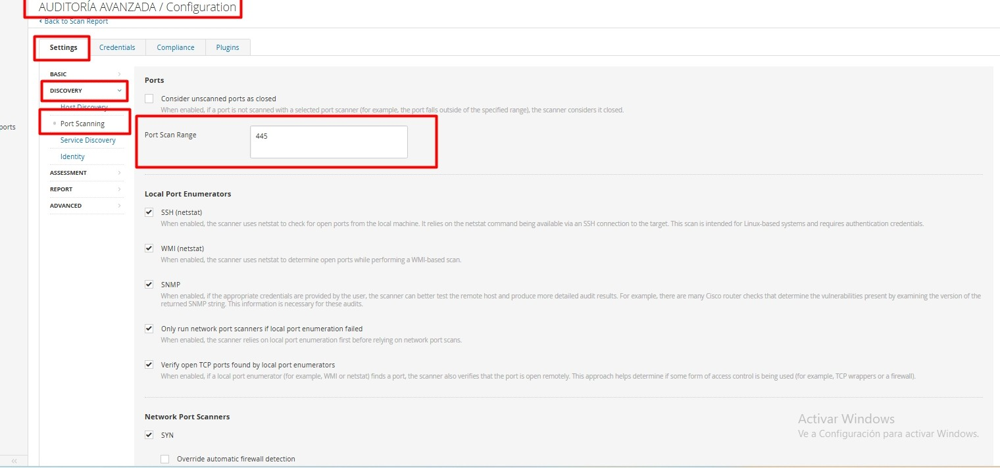
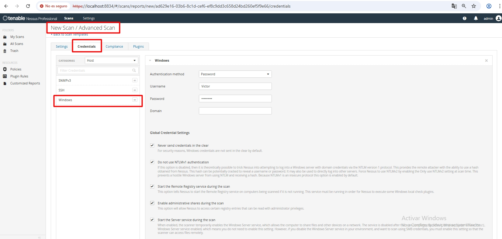
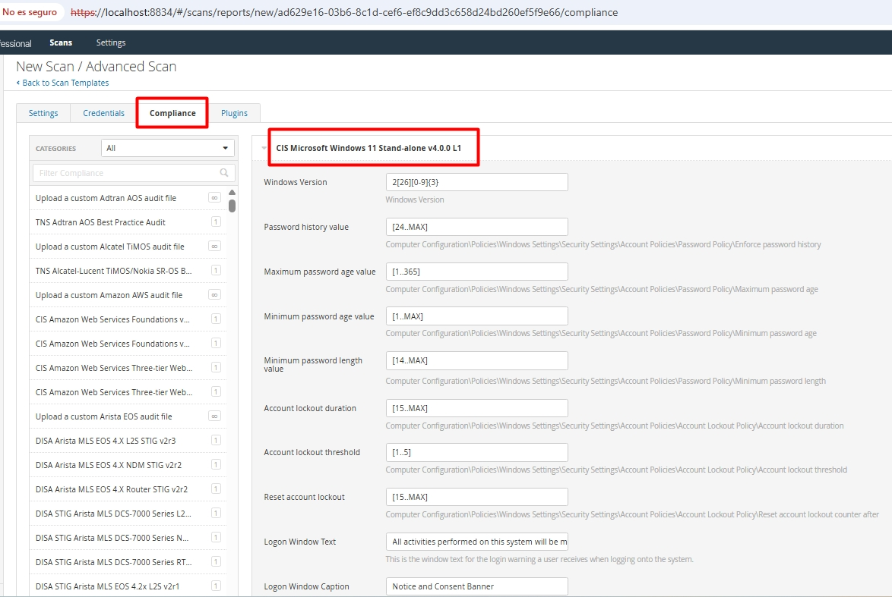
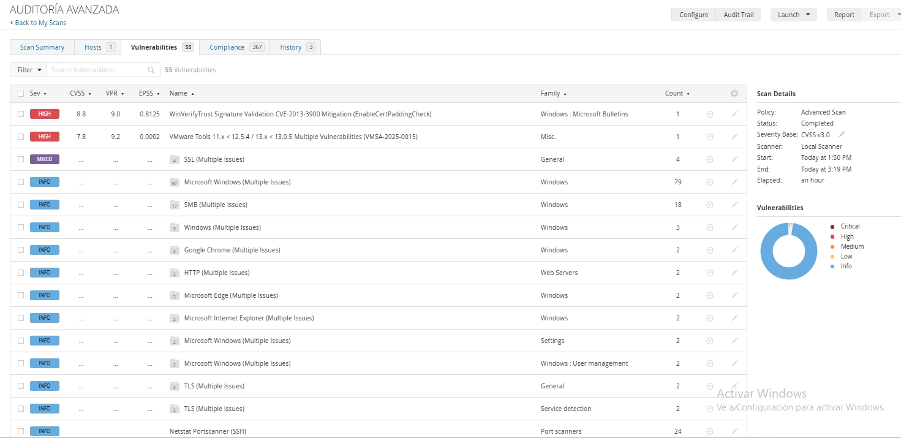
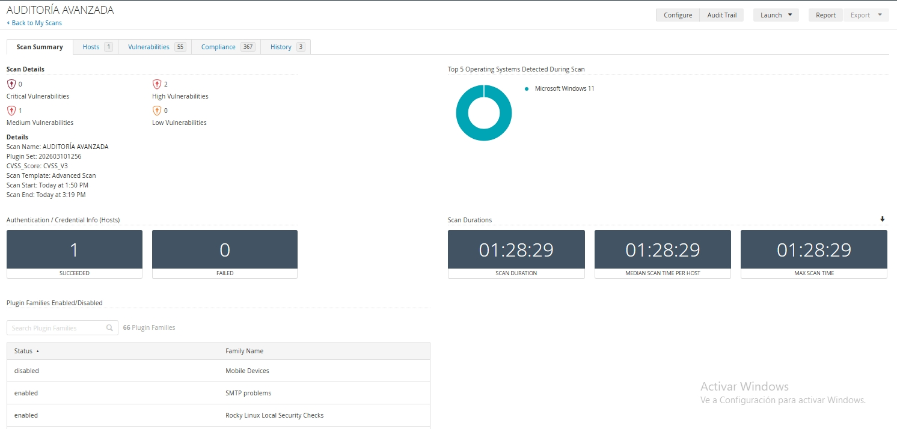
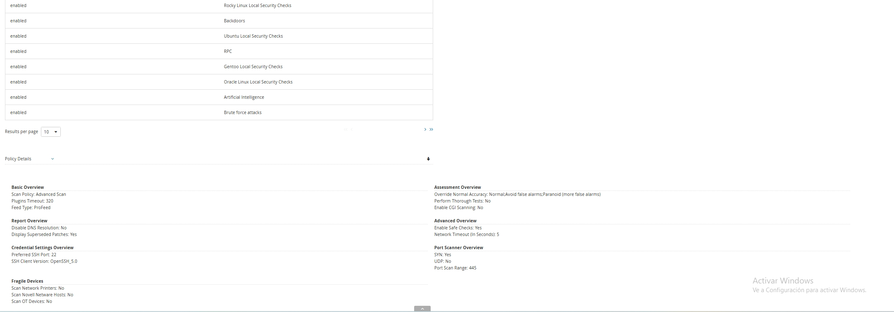

## 🔍 Caso Práctico: Auditoría con Credenciales y Cumplimiento (Compliance)

Para elevar el nivel de este laboratorio, decido no limitarme a un escaneo de red básico. Ejecuto una **Auditoría de Caja Blanca** (con credenciales) para obtener una visibilidad total sobre las debilidades de configuración del sistema operativo.

## 🏗️ 1. Preparación del Entorno (Windows 11)

  Para que el escaneo sea exitoso y Nessus pueda "entrar" en el sistema operativo, realizo las siguientes configuraciones críticas en el host objetivo:

### ⚙️ 1. Configuración de Servicios
* **Remote Registry:** establezco el servicio en modo **Automático** e **Iniciado**. Esto permite a Nessus realizar consultas sobre el registro del sistema para verificar parches y configuraciones.

Para permitir que Nessus consulte el registro del sistema, sigo estos pasos:
1. Presiono la combinación de teclas Win + R, escribo services.msc y pulso Enter.
2. Localizo el servicio llamado Registro remoto (Remote Registry).
3. Hago clic derecho sobre él y selecciono Propiedades.
4. Establezco el Tipo de inicio en Automático y hago clic en el botón Iniciar.
5. Comando de verificación: también puedo validarlo rápidamente desde PowerShell:
```powershell
Get-Service RemoteRegistry
```



### 🛡️ 2. Reglas de Firewall (SMB)
Habilito el tráfico a través del puerto **445 (TCP)**. Este puerto es esencial para la comunicación **SMB (Server Message Block)**, que es el túnel por el cual Nessus inyectará las credenciales.



### 🔓 3. Bypass de UAC para Cuentas Locales
Como utilizo una cuenta de administrador local, aplico este cambio en el registro mediante PowerShell para permitir que la cuenta administrativa local gestione las consultas remotas de Nessus:

```powershell
New-ItemProperty -Path "HKLM:\SOFTWARE\Microsoft\Windows\CurrentVersion\Policies\System" -Name "LocalAccountTokenFilterPolicy" -Value 1 -PropertyType DWord -Force
```


## ⚙️ 2. Configuración en Nessus Expert

Una vez preparado el sistema operativo, procedo a configurar la tarea de escaneo en la consola de Nessus, transformando un análisis básico en una auditoría profesional.

### ⚙️ Paso 0: Configuración General (Settings) - El Paso Más Importante
Antes de definir qué vamos a auditar, debo establecer los parámetros de conexión. Sin esta base, Nessus no podrá alcanzar los servicios que habilitamos en el paso 1:

* **Name:** asigno un nombre identificativo que refleje el estándar usado, por ejemplo: `Auditoría Windows 11 - CIS v4.0.0`.
* **Targets:** introduzco la dirección IP del equipo objetivo. Es vital que sea la IP estática configurada previamente para asegurar que la comunicación no se pierda durante las ráfagas de paquetes del escaneo.
* **Discovery:** configuro el escaneo para que realice una detección de servicios exhaustiva. Esto garantiza que Nessus localice el puerto **445 (SMB)** y el servicio de **Registro Remoto**, que son las puertas de entrada para nuestra auditoría con credenciales.




### 🔑 Paso 1: Gestión de Credenciales
* En la configuración del escaneo, accedo a la pestaña **Credentials** > **Windows**.
* Configuro el usuario administrativo y la contraseña de mi equipo.
* **Authentication Method:** selecciono el método **Password** para permitir que Nessus realice la inyección de credenciales mediante SMB.



### 📋 Paso 2: Auditoría basada en el Estándar CIS
En lugar de un escaneo genérico, cargo una política de cumplimiento basada en el benchmark actualizado **CIS Microsoft Windows 11 Stand-alone v4.0.0 L1**.

* **Objetivo:** evaluar el nivel de *Hardening* del equipo frente a un estándar de la industria altamente riguroso.
* **Proceso:** Nessus verifica automáticamente cientos de configuraciones, como la longitud mínima de contraseñas, servicios innecesarios activos y políticas de auditoría de eventos específicas para la versión más reciente de Windows 11.




## 📈 3. Ejecución y Análisis de Resultados

Tras lanzar el escaneo, monitorizo la pestaña de hallazgos. Una auditoría con credenciales exitosa revela información crítica que un escaneo básico ignoraría, dividiéndose en dos grandes categorías:

### 🔴 A. Vulnerabilidades y Parches (VPR)
Gracias a las credenciales, Nessus puede listar todos los programas instalados y compararlos con su base de datos.
* **Hallazgos:** observo los parches de seguridad faltantes tanto en el sistema operativo como en aplicaciones críticas.
* **Priorización:** utilizo la métrica VPR (Vulnerability Priority Rating) para identificar qué vulnerabilidades tienen más probabilidad de ser explotadas en el mundo real, permitiéndome enfocar los esfuerzos de remediación.



### 🟢 B. Análisis de Cumplimiento (Compliance)
Esta es la parte más detallada de la práctica, donde veo el resultado de la política **CIS v4.0.0**.
* **Puntos de control:** los resultados muestran checks en **verde** (configuración segura), **amarillo** (advertencias) y **rojo** (fallos de configuración que requieren atención inmediata).
* **Detalles de remediación:** al hacer clic en un fallo, Nessus me indica exactamente qué valor de registro o directiva de grupo debo cambiar para cumplir con el estándar.


### 📊 C. Resumen del Estado de Seguridad
Finalmente, analizo el gráfico circular que resume el porcentaje de cumplimiento. Un sistema recién instalado sin *Hardening* suele presentar un alto número de fallos en este apartado, lo que justifica la necesidad de esta auditoría (en mi caso, es un Windows 11 recién instalado).




## 🏆 4. Conclusión de la Práctica

La ejecución de esta auditoría avanzada bajo el estándar **CIS v4.0.0** me ha permitido extraer las siguientes conclusiones fundamentales sobre la seguridad de activos:

* **👁️Visibilidad profunda:** un escaneo sin credenciales es solo una inspección superficial. Al proporcionar acceso autenticado, he logrado que Nessus identifique vulnerabilidades a nivel de registro y parches de software específicos que de otro modo habrían permanecido invisibles.
* **🛠️Hardening basado en estándares:** el uso de benchmarks internacionales como **CIS** elimina la subjetividad en la seguridad. Ya no se trata de "creer" que el equipo es seguro, sino de medirlo contra un estándar de oro utilizado por las mejores empresas del mundo.
* **⚖️Diferencia entre vulnerabilidad y cumplimiento:** durante la práctica, he comprobado que un sistema puede estar "parcheado" (sin vulnerabilidades críticas de software) pero seguir siendo inseguro debido a malas configuraciones de red o de políticas de usuario (fallos de compliance).
* **💼Valor para la organización:** este tipo de auditorías periódicas permiten establecer una línea base de seguridad real, facilitando la toma de decisiones para futuras inversiones en ciberseguridad y garantizando que los activos cumplen con las normativas vigentes.

---
[Volver a la documentación](../README.md)
